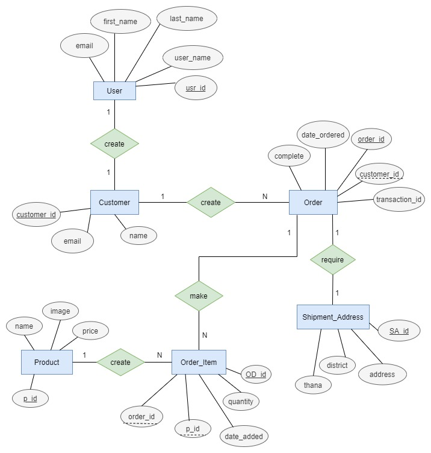

# BRIKKHO.com
E-commerce website created with Django


<!-- ## Database Model:
 -->

<!-- ## Technologies Used:
 Django, Html, CSS, Bootstrap, Javascrpit, Sqlite3 -->

## Run It:
* Clone the project or download as zip:
```
git clone https://github.com/FahadulShadhin/brikkho.git
```

* Install required python packages:
```
pip install -r requirements.txt
```

* Run server:
```
python3 manage.py runserver
```

<p>>> The website should be running at development server 127.0.0.1:8000</p>
<p>>> Copy the link and open it in a browser.</p>

* Make migrations to database:
```
python3 manage.py makemigrations
python3 manage.py migrate
```
* Get admin access:
```
python3 manage.py createsuperuser (enter username, email, password)
```
